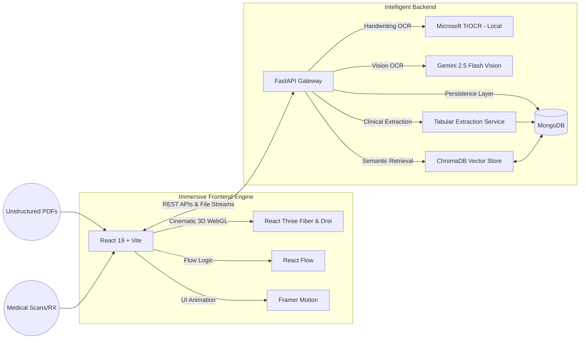

# 🧬 ETHCR4CK — Clinical Intelligence Research Platform

[](https://fastapi.tiangolo.com/)
[](https://reactjs.org/)
[](https://aistudio.google.com/)
[](https://www.mongodb.com/)
[](https://threejs.org/)

> **Immersive, High-Fidelity Clinical Data Extraction, Synthesis, and Verified Research Q&A**

---

## 🌟 Overview

**ETHCR4CK** is a professional-grade clinical intelligence platform designed to bridge the gap between unstructured medical documentation and structured research insights. Built for doctors, clinical researchers, and trial managers, it leverages multimodal AI to ingest everything from PubMed PDFs to handwritten prescriptions and X-rays, transforming them into a structured, queryable research database.

### 🏆 Key Innovation Features

*   **🎮 Immersive 3D UI (Day/Night Cycle)**: Enter the system via a fully rendered 3D cinematic CEO office. Features a real-time Day/Night lighting cycle synced to your local timezone, utilizing WebGL and `@react-three/fiber` for an unparalleled premium experience.
*   **📸 Dual-Pipeline Handwriting Recognition (TrOCR + Gemini)**: Powered by a sophisticated graceful-degradation pipeline. The system loads **Microsoft TrOCR** locally to enhance messy, cursive clinical handwriting. If system constraints prevent local models, it seamlessly falls back to Gemini 2.5 Flash Vision processing without crashing.
*   **💾 Persistent Multi-Session State**: Backed by **MongoDB**, all uploads, parsed clinical metadata, and RAG chat histories are persistently saved across restarts.
*   **📊 Tabular Intelligence**: 
    *   **Auto-Detect Parameters**: AI analyzes your active documents and suggests the 4-6 most relevant headers (e.g., `Patient Demographics`, `Drug Dosage`, `Contraindications`).
    *   **Confidence Scoring**: Every extracted clinical finding includes a transparent confidence badge indicating AI reliability.
*   **🧠 Exec Synthesis & Verified Q&A**: RAG-powered chat with **exact source badges** citing document names and page numbers for absolute data traceability.
*   **📄 Professional Reporting**: Export all extracted findings into timestamped **PDF or DOCX** reports for peer review or clinical documentation.

---

## 🏗 System Architecture



---

## ⚡ Quick Start (Developer Setup)

### 📋 Prerequisites
*   Node.js (v18+)
*   Python 3.11+
*   Google Gemini API Key(s)
*   MongoDB Local Server or Atlas URI

### 1. Backend Setup
```powershell
cd backend
python -m venv venv
.\venv\Scripts\activate
pip install -r requirements.txt
python -m spacy download en_core_web_sm
```

*(Optional) Install deep-learning libraries for offline TrOCR Handwriting Enhancement:*
```powershell
pip install transformers torch torchvision Pillow
```

### 2. Configure Environment (`backend/.env`)
Create a `.env` file in the `backend/` directory:
```env
# AI Models
GEMINI_API_KEYS=YOUR_API_KEY_1,YOUR_API_KEY_2
TROCR_ENABLED=1

# Persistence
MONGODB_URI=mongodb://localhost:27017/
MONGODB_DB_NAME=ethcr4ck

# Storage
UPLOAD_DIR=./data/sample_pdfs
CHROMA_DB_PATH=./data/chroma_db
```

### 3. Execution
**Terminal 1 (Backend):**
```powershell
cd backend
.\venv\Scripts\activate
uvicorn main:app --reload --port 8000
```

**Terminal 2 (Frontend):**
```powershell
cd frontend
npm install
npm run dev
```

---

## 📊 Feature Demonstrations

### ✧ Dynamic Parameter Detection
Don't know what to look for? Click **"Auto-Detect Parameters"**. The system scans the document type and suggests the most critical clinical data points to extract.

### ✧ Clinical Confidence Badging
Trust but verify. Our system reports **Confidence Percentages** for every single cell, allowing doctors to focus on verified data immediately.

### ✧ Execute Synthesis
Go beyond per-document analysis. The system synthesizes findings from multiple sources into a single coherent **Executive Research Summary**.

---

## 🧹 Maintenance & Clean-up
To wipe the AI memory and physical file cache for a fresh demonstration:
```powershell
Remove-Item -Recurse -Force backend\data\chroma_db; Remove-Item -Recurse -Force backend\data\sample_pdfs
```
*(Note: You will also need to drop the `ethcr4ck` schema in MongoDB to hard reset sessions)*

---

## 🛠 Tech Stack 
*   **AI Core:** Gemini 2.5 Flash (1M+ context window) & Microsoft TrOCR
*   **Data Layer:** MongoDB (Sessions/History) & ChromaDB (Vector Search)
*   **Reporting:** jsPDF & docx-js
*   **UI Framework:** React 19 + Vite + Framer Motion
*   **3D Render Engine:** Three.js + `@react-three/fiber`

---
*Developed for the future of Evidence-Based Medicine.*
